# Gateway

In this document, on the one hand, the technical characteristics of the hardware are described, as well as the components of the device. On the other hand, the programming methods and the configuration commands of the meteorological data concentrator device (Iot-LoRa-Gateway) are indicated. It is worth mentioning that the product is compatible with devices that have LoRa communication.

## Technical Characteristics

The central processing unit of the equipment is the Lopy4 development card, the most relevant features were taken from [Lopy 4 datasheet!](https://docs.pycom.io/datasheets/development/lopy4/#datasheet).

### Electrical

-   Input voltage: 3.5 - 4.2V
-   Output voltage: 3,3V, 1.2 A.
-   Max Input sink curren - GPIO: 12mA
-   Input leakage current: 50nA
-   Max Output source current: 12mA

### CPU

-   Xtensa® dual–core 32–bit LX6 microprocessor(s), up to 600 DMIPS
-   Hardware floating point acceleration
-   Python multi–threading
-   An extra ULP–coprocessor that can monitor GPIOs, the ADC channels
    and control most of the internal peripherals during deep–sleep mode
    while only consuming  25uA

### Memory

-   RAM: 520KB + 4MB
-   External flash: 8MB

### LoRa

-   Frequency Range: 137–1020MHz
-   Spreading factor: 6 – 12
-   Effective Bitrate: 0.018 – 37.5 kpbs
-   Sensitivity: –111 to –148 dBm

### WiFi

-   802.11b/g/n 16mbps.

### Bluetooth

-   Low energy and classic
-   Compliant with Bluetooth v4.2 BR/EDR and BLE
-   +12 dBm transmitting power
-   Standard HCI based on SDIO/SPI/UART specification

### GPRS

-   supports command including 3GPP TS 27.007, 27.005 and SIMCOM
    enhanced AT Commands.
-   Working Voltage: 3.5 4.2V
-   Quad-band 850/900/1800/1900MHz
-   Send and receive GPRS data (TCP/IP, HTTP, etc.)
-   low current consumption - 1mA in sleep mode.

### Power Supply

-   Lithium battery 3.7V 6000mAh.
-   MPPT charge controller for 3.7V lithium batteries.
-   Solar Panel 6V.

## Hardware component description.

The hardware is integrated into a Printed Circuit Board (PCB), it has as its main component the Lopy4 development module, responsible for carrying out control, storage and transmission tasks. The other peripherals that the device has (RTC ds3231, FTDI Basic, DHT22 y GPRS SIM800L) are connected to the aforementioned Central Processing Unit (Lopy4).

In addition to the PCB mentioned above, the device has a Lithium battery, an MPPT charge controller and a 6V solar panel.

| 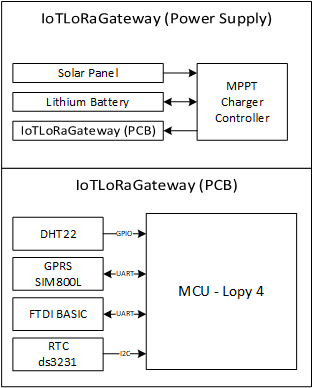 |
|:--:| 
| *IoT LoRa Gateway Architecture* |

### Lopy4 connections

La tarjeta Lopy4 cuenta con 28 pines, entre los cuales están los pines de alimentación y una salida de 3.3V, la disposición de los mismos y su conexion con los distintos periféricos se detallana a continuación:

-   P0: Rx P1: Tx. Comunicación UART con el FTDI Basic.
-   P2: Pin de Arranque, para actualizar el firmware.
-   P3: Tx P4: Rx. Comunicación UART con el SIM 800L.
-   P8: Pin de Arranque para el SIM 800L.
-   P9: SDA P10: SDL. Comunicación I2C con el RTC ds3231.
-   P21: Pin de control de modo de funcionamieto.
-   P22: Pin de lectura del nivel de tensión de Batería.
-   P23: Pin de lectura de señal del sensor DHT22.

| 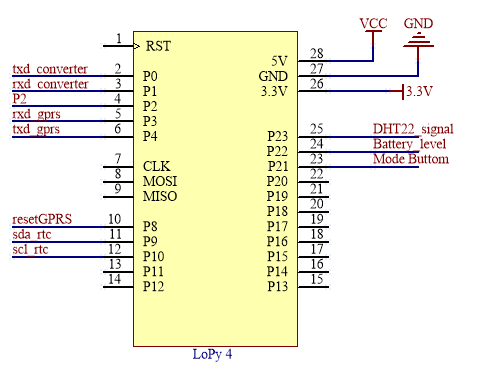 |
|:--:| 
| *Lopy4 pin connections.* |

### Peripheral Connections

### DHT22

The internal temperature and humidity sensor is connected to a digital pin of the MCU, configured as an input, a pull up resistor is also connected to the signal output, as in the following figure:


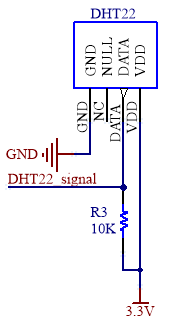

### GPRS SIM800L

Este periferico utiliza el protocolo UART para conectarse al MCU y un pin digital para el control de arranque del mismo, como podemos observar en la figura a continuación. Está alimentado desde la batería de litio (3.7V - 4.2V).

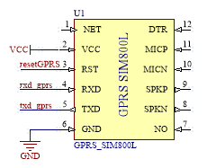

### FTDI Basic

El módulo se conecta al MCU a través del protocolo UART y comparte la misma referencia de GND.

### RTC DS3231

Este periferico se conecta al MCU a través del protocolo I2C, se utilizan dos resistencia de pull up en los pines de comunicación (ver figura [fig:DS3231PinCon] ), además cuenta con una pila pequeña que lo alimenta en caso de corte de energía.

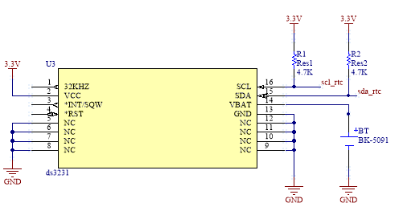

# Installation and Start-up

This section introduces the start-up of the device, gives a brief description of the software to be used and describes the commands required for configuration. A continuación se muestra una vita 3D del dispositivo LoRa Gateway IoT y un detalle de con cada uno de sus componetes:

-   U1: GPRS module SIM 800L
-   U2: Lopy 4
-   U3: RTC DS3231
-   J1: Temperature and humidity sensor DHT22
-   P1: Power In connector
-   H1: Jumper conector - boot mode selector.
-   H2: usb to serial converter.
-   S1: Operating mode selector button

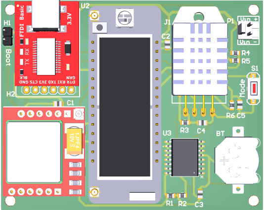 

## Start-up

Para comenzar la configuración del Gateway, es necesario descargar el software para gestión y programación según lo indicado en la pagina de [Documentos de Pycom Lopy4](https://docs.pycom.io/gettingstarted/software/). Se puede trabajar con las 2 opciones tanto el software “ATOM” como también “Visual Studio Code”.

En caso de usar Windows es necesario descargar los drivers del conversor Usb-serial desde la página de [FTDI Chip -VCP](https://ftdichip.com/drivers/vcp-drivers/) , de esta manera se tiene el puerto COM correspondiente.

Una vez se han instalado los componentes de software, conecte la placa a la alimentación a travéz de P1 y a una PC con un cable micro USB para uso de datos, a travéz de P2.

La placa tiene un led que indica el arranque normal de la placa y el modo en que se encuentra funcionando. La secuencia inicia con el led de color verde encendido por 3 segundos, lo que quiere decir que la placa entra en modo de espera (Modo de configuración).

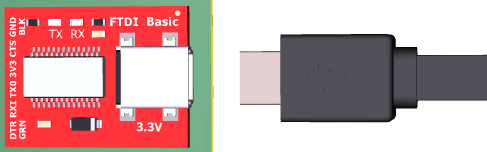 

Ahora es necesario abrir el entorno de programación, para agregar el dispositivo COM y configuar el dispositivo gateway. A continuación se detallan los pasos a seguir:

-   Open Pymakr.

    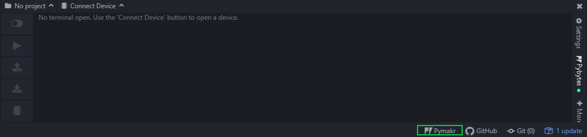 

-   Open Global Settings.

    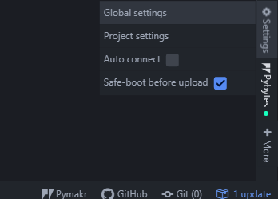
    
-   Set the corresponding COM port, verify from the device manager.

    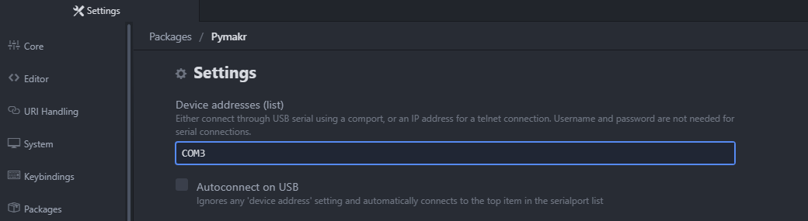 
    
-   Open COM port from Connected Devices.

    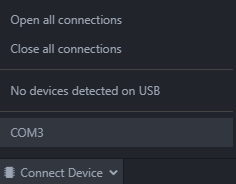 
    
    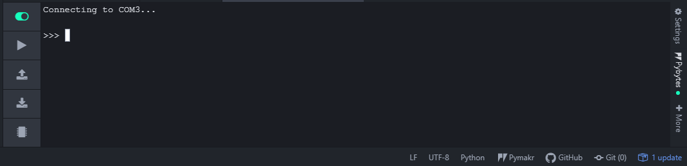 

Configuration Methods
---------------------

### System Operation

Como se mencionó en el apartado anterior, el led verde encendido por 3 segundos luego de conectar la placa, indica que está lsita la configuración. Para empezar el funcionamiento automatico del sistema se debe crear un archivo de configuración con el método detallado a continuación.

The system automatically resets and the next process begins:

-   Time and date synchronization.
-   Alarm initiation for packet transmission.
-   Send synchronization packet to the nodes.
-   Deep sleep mode until the data packet is sent back to the server,

When the sending time is reached, the system performs the following repetitive process:
-   Time and date synchronization.
-   Alarm initiation for packet transmission.
-   Send channel assignment packet.
-   Send data to the server.
-   Deep sleep mode until the data packet is sent back to the server,

```python:
configFile(stationNum, idStation, Url, NTPServer, frequencyTx)
```
-   stationNum: Number of nodes to be connected to the Gateway.
-   idStation: Gateway ID (240 - 255).
-   Url: Url for transmitting packets via http get.
-   NTPServer: NTP server IP.
-   frequencyTx: Packet Transmission Frequency in minutes.
-   Example: configFile(3, 250,
    “http://api.thingspeak.com/update?api\_key=XXXX&field1=”,“162.159.200.1”,
    5)

### GPRS SIM800L mobile connection

To configure the device, the first thing to consider is the time synchronization via Network time protocol (NTP) and the GPRS SIM 800L

The following are the methods for synchronization with the GPRS SIM 800L module.

```python:
sim800L.signalLevel(None)
```
-   Response: +CSQ: rssi, ber
    -   rssi
        -   0: -115 dBm or less
        -   1: -111 dBm
        -   2...30: -110... -54 dBm
        -   31: -52 dBm or greater
        -   99: not known or not detectable
    -   ber (in percent):
        -   0...7 As RXQUAL values in the table in GSM 05.08
        -   99 Not known or not detectable

```python:
sim800L.GPRS\_init(None)
```

-   Response: +SAPBR: cid, Status, IP\_Addr
    -   cid : Bearer profile identifier
    -   Status
        -   0 Bearer is connecting
        -   1 Bearer is connected
        -   2 Bearer is closing
        -   3 Bearer is closed
    -   IP\_Addr: IP address

```python:
sim800L.GPRS\_NTP(None)
```

-   Response: +SAPBR: cid, Status, IP\_Addr
    -   cid : Bearer profile identifier
    -   Status
        -   0 Bearer is connecting
        -   1 Bearer is connected
        -   2 Bearer is closing
        -   3 Bearer is closed
    -   IP\_Addr: IP address
-   Response: (year, day, month, hour, minute, second, millisecond,
    None)

### Real time clock (RTC) ds3231

The external real time clock (RTC) ds3231 is the one that will keep the
system synchronized in time and date, because it has an independent
battery. The methods for synchronization are presented below.


```python:
ds3231.ds1307init\_sinc(None)
```

-   Synchronizes the external real-time clock (ds3231) with the internal
    time (lopy 4).
-   Response: (year, day, month, hour, minute, second, millisecond,
    None)

```python:
get\_time\_ds3231(None)
```

-   Obtains the date and time from the external real-time clock
    (ds3231).
-   Response: (year, day, month, hour, minute, second, millisecond,
    None)

```python:
ds3231.sinc\_RTC\_from\_ds3231(None)
```
-   Synchronizes the internal clock (lopy 4) with the time of the
    external real-time clock (ds3231).
-   Response: (year, day, month, hour, minute, second, millisecond,
    None)

### Temperature and humidity sensor DHT11

The sensor reading is done by the following method:
```python:
result = th.read(None)
```

-   Response: result.temperature
-   Response: result.humidity

## Functionality and cost

Release a version 1.0 of your project:

```bash
npm run docusaurus docs:version 1.0
```

The `docs` folder is copied into `versioned_docs/version-1.0` and `versions.json` is created.

Your docs now have 2 versions:

- `1.0` at `http://localhost:3000/docs/` for the version 1.0 docs
- `current` at `http://localhost:3000/docs/next/` for the **upcoming, unreleased docs**

## Hardware (all the details needed to make it)

To navigate seamlessly across versions, add a version dropdown.

Modify the `docusaurus.config.js` file:

```js title="docusaurus.config.js"
module.exports = {
  themeConfig: {
    navbar: {
      items: [
        // highlight-start
        {
          type: 'docsVersionDropdown',
        },
        // highlight-end
      ],
    },
  },
};
```

The docs version dropdown appears in your navbar:


## Scripts (the full scripts with some explanation)
Los scripts con los que cuenta el sistema se encuentran divididos en archivos .py que contienen las calses y los métodos para el correcto funcionamiento del sistema. Se encuentran divididos en los siguientes archivos:

### Boot.py

El primer archivo es el llamado boot.py, es el que arranca el sistema y en el se define:

- La comunicación serial para la consola de visualización y para subir los programas.
- Se desabilita el módulo WIFI para reducir el consumo energético.
- Se define el programa que arrancará a continuación de estás configuraciones.

```python

import machine
import os
from machine import UART
from network import WLAN
from network import Server

###-- Uart for console communication.

uart = UART(0, baudrate=115200)
os.dupterm(uart)

###-- Disable WIFI.

wlan = WLAN(mode=WLAN.STA)
wlan.init(mode=WLAN.AP, ssid='gateway-station', auth=(WLAN.WPA2,'gateway-station'), channel=7, antenna=WLAN.INT_ANT)
wlan.deinit()

###-- File to be run first.

machine.main('main.py')

```
### sim800L.py

```python

import time
import pycom
import os
from machine import RTC
from machine import Timer
from machine import UART

class SIM800L():
    
    def __init__(self):
        self.__ser_gprs = UART(1, baudrate=9600)
        self.__rtc = RTC()
        time.sleep(1.0)

####--- Method of reading the GPRS response to AT commands.

    def readGPRSdata(self):

        time.sleep(0.2)
        readData = False
        scape = False
        datos_gprs=True
        gprsdataread=''
        chrono = Timer.Chrono()
        chrono.start()

        while (datos_gprs == True):
            time.sleep(0.2)
            timeWait=chrono.read()

            if(self.__ser_gprs.any() > 0):
                gprsdataread= gprsdataread + str(self.__ser_gprs.readall())
                readData = True
                scape = False
                chrono.reset()
            elif readData == True:
                if scape == False:
                    scape = True
                    continue
            if(timeWait > 40 or scape == True):
                datos_gprs=False

        chrono.stop()
        chrono.reset()
        #print(gprsdataread, len(gprsdataread))

        return gprsdataread

###--- Method to check the GPRS band and configuration in "GSM850_MODE" mode.

    def bandGPRS(self):
        self.__ser_gprs.write("AT+CBAND?")
        self.__ser_gprs.write("\r\n")
        self.readGPRSdata()
        self.__ser_gprs.write("AT+CBAND=\"GSM850_MODE\"")
        self.__ser_gprs.write("\r\n")
        self.readGPRSdata()

###--- Verify GPRS signal.

    def signalLevel(self):
        self.__ser_gprs.write("AT+CSQ")
        self.__ser_gprs.write("\r\n")
        dataRead = self.readGPRSdata()

        arraydataread=str(dataRead).split("\\r\\n")
        print(arraydataread[1])
        comp=":0,0" in arraydataread[1]

        if (comp==True or arraydataread[1]=="ERROR"):
            return False

        return True

###-- Connect to the Internet to initiate communication.

    def GPRS_init(self):

        contRetrans = 0
        float_retransmit=True

        try:

            self.__ser_gprs.write("AT+SAPBR=0,1\r\n")
            time.sleep(2)
            self.readGPRSdata()

            self.__ser_gprs.write("AT+SAPBR=3,1,\"APN\",\"internet.claro.com.ec\"\r\n")
            self.readGPRSdata()

            self.__ser_gprs.write("AT+SAPBR=1,1\r\n")
            time.sleep(2)
            gprsdataread = self.readGPRSdata()

            self.__ser_gprs.write("AT+SAPBR=2,1\r\n")
            dataRead = self.readGPRSdata()

            arraydataread=str(dataRead).split("\\r\\n")
            print(arraydataread[1])
            comp="0.0.0.0" in arraydataread[1]

            if comp==True or arraydataread[1]=="ERROR":
                float_retransmit=False

        except Exception as e:
            print("Error network connecting")
            float_retransmit=False

        time.sleep(1)

        return float_retransmit

###-- Connect to the NTP server and match system time.

    def GPRS_NTP(self):
        float_retransmit=True
        try:
            self.__ser_gprs.write("AT+SAPBR=0,1\r\n")
            time.sleep(2)
            self.readGPRSdata()
            contRetrans = 0
            self.__ser_gprs.write("AT")
            self.__ser_gprs.write("\r\n")
            self.readGPRSdata()
            self.__ser_gprs.write("AT+CSQ")
            self.__ser_gprs.write("\r\n")
            self.readGPRSdata()
            self.__ser_gprs.write("AT+SAPBR=3,1,\"Contype\",\"GPRS\"\r\n")
            self.readGPRSdata()
            self.__ser_gprs.write("AT+SAPBR=3,1,\"APN\",\"internet.claro.com.ec\"\r\n")
            self.readGPRSdata()
            self.__ser_gprs.write("AT+SAPBR=1,1"+"\r\n")
            time.sleep(3)
            self.readGPRSdata()
            self.__ser_gprs.write("AT+SAPBR=2,1"+"\r\n")
            dataRead = self.readGPRSdata()
            arraydataread=str(dataRead).split("\\r\\n")
            print(arraydataread[1])
            
            comp="0.0.0.0" in arraydataread[1]
            if comp==True or arraydataread[1]=="ERROR":
                float_retransmit=False
            if float_retransmit==True:
                self.__ser_gprs.write("AT+CNTPCID=1"+"\r\n")
                self.readGPRSdata()
                self.__ser_gprs.write("AT+CNTP=\"162.159.200.1\",-20"+"\r\n")   ###-- Ip NTP server
                self.readGPRSdata()
                self.__ser_gprs.write("AT+CNTP"+"\r\n")
                self.readGPRSdata()
                #self.readGPRSdata()
                self.__ser_gprs.write("AT+CCLK?"+"\r\n")
                gprsdataread = self.readGPRSdata()
                NMEA1 = str(gprsdataread)
                #print(NMEA1)
                NMEA1_array = NMEA1.split("\\r\\n")
                #print(NMEA1_array)
                
                if(len(NMEA1_array)>2 and len(NMEA1_array[1].split(","))==2):
                    datos_fecha_hora= NMEA1_array[1].split(",")
                    #print(datos_fecha_hora[0])
                    seg_gprs=int(datos_fecha_hora[1][6:8])
                    min_gprs=int(datos_fecha_hora[1][3:5])
                    hora_gprs=int(datos_fecha_hora[1][0:2])
                    dia_gprs=int(datos_fecha_hora[0][14:16])
                    mes_gprs=int(datos_fecha_hora[0][11:13])
                    age_gprs=int(datos_fecha_hora[0][8:10])+2000
                    #print(hora_gprs,min_gprs,seg_gprs,dia_gprs,mes_gprs,age_gprs)
                    self.__rtc.init((age_gprs, mes_gprs, dia_gprs, hora_gprs, min_gprs, seg_gprs, 0, 0),source=RTC.INTERNAL_RC) #COnfig Clock
                    epoch_time=time.time()
                    tuple_time = time.gmtime(epoch_time+8)
                    self.__rtc.init(tuple_time)
                    print(self.__rtc.now())
                    pycom.heartbeat(False)
                    pycom.rgbled(0x007f00)
                    time.sleep(0.25)
                    pycom.heartbeat(False)
                    time.sleep(0.25)
                    pycom.rgbled(0x007f00)
                    time.sleep(0.25)
                    pycom.heartbeat(False)
                    time.sleep(1)
            else:
                print("THE TIME CANNOT BE SYNCHRONIZED")
                pycom.heartbeat(False)
                pycom.rgbled(0x7f0000)
                time.sleep(0.25)
                pycom.heartbeat(False)
                time.sleep(0.25)
                pycom.rgbled(0x7f0000)
                time.sleep(0.25)
                pycom.heartbeat(False)
                time.sleep(2)

        except Exception as e:

            print("Error NTP server connecting")
            float_retransmit=False
            
        self.__ser_gprs.write("AT+SAPBR=0,1\r\n")
        time.sleep(2)
        self.readGPRSdata()
        time.sleep(1)

        return float_retransmit

###-- Sending data to the server provided, via HTTP get.

    def send_GPRS(self,url_trasm):

        contRetrans = 0
        maxRetrans = 5
        float_retransmit=True
        gprsdataread=''
        flagTrans1=False

        self.__ser_gprs.write("AT+HTTPTERM")
        self.__ser_gprs.write("\r\n")
        self.readGPRSdata()
        self.__ser_gprs.write("AT+HTTPINIT")
        self.__ser_gprs.write("\r\n")
        self.readGPRSdata()
        self.__ser_gprs.write("AT+HTTPPARA=\"CID\",1\r\n")
        self.readGPRSdata()
        self.__ser_gprs.write("AT+HTTPPARA=\"URL\"," +"\""+url_trasm+"\""+"\r\n")
        self.readGPRSdata()
        self.__ser_gprs.write("AT+HTTPACTION=0\r\n")
        self.readGPRSdata()
        time.sleep(2)
        gprsdataread=self.readGPRSdata()

        print(gprsdataread)

        if (str(gprsdataread).find("HTTPACTION: 0,200")==-1):
            print("Send Failed ")
            flagTrans1=False

        if (str(gprsdataread).find("HTTPACTION: 0,200") >= 0):
            print("Send OK")
            flagTrans1=True

        self.__ser_gprs.write("AT+HTTPTERM\r\n")
        self.readGPRSdata()

        self.__ser_gprs.write("AT+SAPBR=0,1\r\n")
        time.sleep(2)
        self.readGPRSdata()

        return flagTrans1

###-- GPRS in sleep mode to reduce power consumption.

    def GPRS_sleep(self):
        self.__ser_gprs.write("AT+CSCLK=1\r\n")
        gprsdataread=self.readGPRSdata()
        time.sleep(2)

 ```
 ### ds3231.py
 
 ```python
 
import time
import pycom
import os
from machine import RTC
from machine import I2C

class DS3231():

    def __init__(self):
        self.__i2c = I2C(0, I2C.MASTER, baudrate=100000)
        self.__rtc = RTC()
        time.sleep(1.0)
        self.__i2c.deinit()
###--Set external clock to default values.
    def DS3231init(self):
        self.__i2c.init()
        time.sleep(0.5)
        #self.__i2c.writeto(0x68,chr(0xD0))
        self.__i2c.writeto(0x68,chr(0))
        self.__i2c.writeto_mem(0x68,0,chr(0x00))
        self.__i2c.writeto_mem(0x68,1,chr(0x49))
        self.__i2c.writeto_mem(0x68,2,chr(0x17))
        self.__i2c.writeto_mem(0x68,4,chr(0x14))
        self.__i2c.writeto_mem(0x68,5,chr(0x06))
        self.__i2c.writeto_mem(0x68,6,chr(0x18))
        self.__i2c.writeto_mem(0x68,7,0x10)
        self.__i2c.deinit()
###-- Synchronize external clock ds3231 from the Lopy4 clock.
    def ds1307init_sinc(self):
        reloj_rtc_int=self.__rtc.now()
        hora_rtc_ext= str(reloj_rtc_int[3])
        hora_rtc_ext_hex = int(self.decode_ds1307(hora_rtc_ext))
        min_rtc_ext= str(reloj_rtc_int[4])
        min_rtc_ext_hex= int(self.decode_ds1307(min_rtc_ext))
        seg_rtc_ext= str(reloj_rtc_int[5])
        seg_rtc_ext_hex = int(self.decode_ds1307(seg_rtc_ext))
        dia_rtc_ext= str(reloj_rtc_int[2])
        dia_rtc_ext_hex = int(self.decode_ds1307(dia_rtc_ext))
        mes_rtc_ext= str(reloj_rtc_int[1])
        mes_rtc_ext_hex = int(self.decode_ds1307(mes_rtc_ext))
        ann_rtc_ext= str(reloj_rtc_int[0])
        ann_rtc_ext_hex = int(self.decode_ds1307(ann_rtc_ext[2:4]))
        print(hora_rtc_ext_hex, min_rtc_ext_hex, seg_rtc_ext_hex)
        self.__i2c.init()
        self.__i2c.writeto(0x68,chr(0))
        self.__i2c.writeto_mem(0x68,0,chr(seg_rtc_ext_hex))
        self.__i2c.writeto_mem(0x68,1,chr(min_rtc_ext_hex))
        self.__i2c.writeto_mem(0x68,2,chr(hora_rtc_ext_hex))
        self.__i2c.writeto_mem(0x68,4,chr(dia_rtc_ext_hex))
        self.__i2c.writeto_mem(0x68,5,chr(mes_rtc_ext_hex))
        self.__i2c.writeto_mem(0x68,6,chr(ann_rtc_ext_hex))
        self.__i2c.writeto_mem(0x68,7,0x10)
        self.__i2c.deinit()
###-- Decode and Code Methods ds3231.
    def decode_ds1307(self,valor_rtc_int):
        binstring = ''
        x=int(valor_rtc_int)
        while True:
            q, r = divmod(x, 10)
            nibble = bin(r).replace('0b', "")
            while len(nibble) < 4:
                nibble = '0' + nibble
            binstring = nibble + binstring
            if q == 0:
                break
            else:
                x = q
        valorhex = int(binstring, 2)
        return valorhex
    def code_ds1307(self,valor_ds1307):
        valor=hex(ord(valor_ds1307))
        valor1= int(valor) & 15                     #segundos.encode("hex")
        valor2= int(valor)>>4
        valorint= int(str(valor2)+str(valor1))
        return valorint
###-- Get time from external clock ds3231.
    def get_time_ds3231(self):
        self.__i2c.init()
        #self.__i2c.writeto(0x68,chr(0xD0))
        self.__i2c.writeto(0x68,chr(0))
        #self.__i2c.writeto(0x68,chr(0xD1))
        segundos=self.__i2c.readfrom_mem(0x68,0,1)
        segundosint= self.code_ds1307(segundos)
        minutos=self.__i2c.readfrom_mem(0x68,1,1)
        minutosint=self.code_ds1307(minutos)
        horas=self.__i2c.readfrom_mem(0x68,2,1)
        horasint=self.code_ds1307(horas)
        dia=self.__i2c.readfrom_mem(0x68,4,1)
        diaint=self.code_ds1307(dia)
        mes=self.__i2c.readfrom_mem(0x68,5,1)
        mesint=self.code_ds1307(mes)
        ann=self.__i2c.readfrom_mem(0x68,6,1)
        annint=self.code_ds1307(ann)
        print(segundos,minutos,horas, segundosint, minutosint, horasint, diaint, mesint, annint)
        self.__i2c.deinit()
###-- Synchronize lopy4 from external clock ds3231.
    def sinc_RTC_from_ds3231(self):
        #self.__i2c = I2C(0, I2C.MASTER, baudrate=100000)
        self.__i2c.init()
        #self.__i2c.writeto(0x68,chr(0xD0))
        self.__i2c.writeto(0x68,chr(0))
        #self.__i2c.writeto(0x68,chr(0xD1))
        segundos=self.__i2c.readfrom_mem(0x68,0,1)
        segundosint= self.code_ds1307(segundos)
        minutos=self.__i2c.readfrom_mem(0x68,1,1)
        minutosint=self.code_ds1307(minutos)
        horas=self.__i2c.readfrom_mem(0x68,2,1)
        horasint=self.code_ds1307(horas)
        dia=self.__i2c.readfrom_mem(0x68,4,1)
        diaint=self.code_ds1307(dia)
        mes=self.__i2c.readfrom_mem(0x68,5,1)
        mesint=self.code_ds1307(mes)
        ann=self.__i2c.readfrom_mem(0x68,6,1)
        annint=self.code_ds1307(ann)+2000
        self.__i2c.deinit()
        self.__rtc.init((annint, mesint, diaint, horasint, minutosint, segundosint, 0, 0),source=RTC.INTERNAL_RC)
        print(self.__rtc.now())
```
### dht.py 

Este archivo contiene la clase y los métodos para la configuración y muestreo del sensor de temperatura y humedad dht22, fue tomada de [JurassicPork/DHT_PyCom](https://github.com/JurassicPork/DHT_PyCom/blob/master/dth.py)

### main.py 

```python
import os
import pycom
from network import LoRa
from machine import Pin
import socket
import time
import utime
from machine import Timer
from machine import RTC
from machine import I2C
import struct
import ustruct
import binascii
from network import WLAN
from dth import DTH
from network import Server
from machine import ADC
import _thread
from network import Server
import network
import ssl
from ds3231 import DS3231
from sim800L import SIM800L

#####################--ID--station and sensor-2bytes---#########################
################################################################################

def getIDS(packetTypePar,stationId,sensorIdWl):

    packetType=packetTypePar       #2bits
    #stationId=7                    #12bits
    #sensorIdWl=1                   #4bits
    sensorIdBl=20                  #12bits

    packetType_bits="{0:b}".format(packetType)
    stationId_bits="{0:b}".format(stationId)
    sensorIdWl_bits="{0:b}".format(sensorIdWl)
    sensorIdBl_bits="{0:b}".format(sensorIdBl)

    packetType_bits=(10-len(packetType_bits))*'0'+packetType_bits
    stationId_bits=(10-len(stationId_bits))*'0'+stationId_bits
    sensorIdWl_bits=(4-len(sensorIdWl_bits))*'0'+sensorIdWl_bits
    sensorIdBl_bits=(10-len(sensorIdBl_bits))*'0'+sensorIdBl_bits

    IDWl=(int('0b'+packetType_bits+stationId_bits+sensorIdWl_bits,2))
    IDBl=(int('0b'+stationId_bits+sensorIdBl_bits,2))

    print(IDWl)

    return IDWl

######################### Clock Default initialization #########################
################################################################################

rtc = machine.RTC()
rtc.init((2018, 2, 5, 17, 52, 10, 0, 0),source=RTC.INTERNAL_RC)

###################### Serial start and Reset GPRS  ############################
################################################################################
sim800L = SIM800L()

p_out_8 = Pin('P8', mode=Pin.OUT)

def GPRS_reset():
    p_out_8.value(0)
    time.sleep(0.5)
    p_out_8.value(1)
    time.sleep(5)

GPRS_reset()

#######################    Create global variables       #######################
################################################################################
class Drips:
    pass

drips = Drips()
drips.wifi_flag=0
drips.count_int=0
drips.countLoraTx=0
drips.device_id=0

class General:
    pass

generals = General()
generals.data_store=""
generals.flag_trans=0
generals.flag_trans1=0
generals.timeSincFlag=False
generals.alarma_temp = ""

arrayStationReceive = []
arrayStationTransmit = []
ArrayStation = []

#########################-- RTC EXTERNAL--######################################
################################################################################

ds3231 = DS3231()

def sincTimeRTC_ext():

    razon_despertar=int(machine.wake_reason()[0])

    if razon_despertar == 2 or generals.timeSincFlag == True:
        ds3231.sinc_RTC_from_ds3231()
    else:
        time.sleep(5)
        sim800L.GPRS_init()
        time.sleep(2)
        generals.timeSincFlag= sim800L.GPRS_NTP()
        ds3231.ds1307init_sinc()
        sleepMode(razon_despertar)

############################# Start DHT11 library  #############################
################################################################################

th = DTH('P23',0)

#########################    Pulsed Read Mode     #############################
################################################################################

def pin_handler(arg):
    if (arg.value()==0):
        time.sleep(2)
        if (p_in.value()==0):
            print("ECENDER WIFI")
            drips.wifi_flag=1
        #ds1307init_sinc()
        #obtener_ds1307()

#p_in = Pin('P13', mode=Pin.IN,  pull=Pin.PULL_UP)
#p_in.callback(Pin.IRQ_FALLING, handler=pin_handler)

############################### WIFI METHODS ###################################
################################################################################
def wifiOn():
    pycom.heartbeat(False)
    time.sleep(0.5)
    pycom.rgbled(0x007f00)
    wlan = WLAN(mode=WLAN.STA)
    wlan.init(mode=WLAN.AP, ssid='gateway-station', channel=7, antenna=WLAN.INT_ANT)  #auth=(WLAN.WPA2,'gateway-station')
    time.sleep(0.2)
    server= Server(login=('gateway', 'gateway'), timeout=60)
    server.timeout(300) # change the timeout
    server.timeout() # get the timeout
    print(server.isrunning()) # check whether the server is running or not
    time.sleep(1)
    pycom.heartbeat(False)

def wifiOff():
    pycom.heartbeat(False)
    time.sleep(0.5)
    pycom.rgbled(0x7f0000)
    wlan = WLAN(mode=WLAN.STA)
    wlan.init(mode=WLAN.AP, ssid='gateway-station', auth=(WLAN.WPA2,'gateway-station'), channel=7, antenna=WLAN.INT_ANT)
    wlan.deinit()
    time.sleep(1)
    pycom.heartbeat(False)
    drips.wifi_flag=0

def wlan_conect():
    # setup as a station
    wlan = network.WLAN(mode=network.WLAN.STA)
    wlan.connect('Name', auth=(network.WLAN.WPA2, 'Password'))#FmlaPlacenciaEspinosa
    while not wlan.isconnected():
        time.sleep_ms(50)
    print(wlan.ifconfig())

def rtcWifiNtp():

    drips.count_int=drips.count_int+1

    if drips.count_int==4:
        machine.reset()

    wlan_conect()
    time.sleep(0.5)
    rtc.ntp_sync("ec.pool.ntp.org") #ec.pool.ntp.org inocar.ntp.ec
    time.sleep(0.2)
    print(rtc.now())
    print(rtc.synced())

    if rtc.synced()==False:

        time.sleep(1)
        wlan_conect()
        time.sleep(1)
        rtcWifiNtp()

    timeepoch = time.time() - 18000
    tuple_time=time.gmtime(timeepoch)
    rtc.init(tuple_time)
    print(rtc.now())
    rtc.ntp_sync(None)

################################ LORA setting ##################################
################################################################################

drips._LORA_PKG_FORMAT = "!BBBB%ds"
drips.frequency = 433000000
drips.lora_sock = ""

lora = LoRa(mode=LoRa.LORA,region=LoRa.EU868, frequency=drips.frequency,tx_power=20, rx_iq=True,sf=12)

def lora_sock_ON():

    drips.lora_sock = socket.socket(socket.AF_LORA, socket.SOCK_RAW)
    drips.lora_sock.setblocking(False)

########################### LORA Interruption ##################################
#################################################################################
def lora_cb(lora):

    events = lora.events()

    if events & LoRa.RX_PACKET_EVENT:

        print("Packet Received")
        lora_sock_ON()
        recpakcom=drips.lora_sock.recvfrom(512)

        recv_pkg =recpakcom[0]
        print(lora.stats())

        if (len(recv_pkg) > 2):

            recv_pkg_len = recv_pkg[1]

            try:

                device_id, pkg_len, type_pkg, device_recept, msg = struct.unpack(drips._LORA_PKG_FORMAT % recv_pkg_len, recv_pkg)

                print (device_id, msg, type_pkg,device_recept)


                if (type_pkg==0 and device_id == 1 and device_recept == 240):

                    arrayStationReceive.append(device_id)
                    datos = binascii.b2a_base64(msg)
                    print(datos)
                    print(str(datos)[2:-3])
                    generals.data_store = generals.data_store+ (str(datos)[2:-3])
                    print(generals.data_store)

                if (type_pkg==0 and device_id == 2 and device_recept==240):

                    arrayStationReceive.append(device_id)

                    if len(msg)==8:
                        id_s_e,binepoch,valor_max = struct.unpack('>HIH',msg)
                        print(id_s_e,binepoch,valor_max)
                        datos = binascii.b2a_base64(msg)
                        print(str(datos)[2:-3])
                        generals.data_store = generals.data_store+ (str(datos)[2:-3])
                        print(datos)
                        print(generals.data_store)
                    else:
                        id_s_e,binepoch,valor_max,temp_val,hum_val,valor_bate_int = struct.unpack('>HIHBBH',msg)
                        print(id_s_e,binepoch,valor_max,temp_val,hum_val,valor_bate_int)
                        datos = binascii.b2a_base64(msg)
                        print(str(datos)[2:-3])
                        generals.data_store = generals.data_store+ (str(datos)[2:-3])
                        print(datos)
                        print(generals.data_store)

                if (type_pkg==0 and device_id == 3 and device_recept == 240):

                    arrayStationReceive.append(device_id)

                    print("Packet Received ")
                    print(len(msg))
                    datos = binascii.b2a_base64(msg)
                    generals.data_store = generals.data_store+ (str(datos)[2:-3])
                    print(datos)
                    print(generals.data_store)

                if (type_pkg==0 and device_id == 4 and device_recept == 240):

                    arrayStationReceive.append(device_id)

                    print("Packet Received ")
                    print(len(msg))
                    datos = binascii.b2a_base64(msg)
                    generals.data_store = generals.data_store+ (str(datos)[2:-3])
                    print(datos)
                    print(generals.data_store)

                if (type_pkg==6):
                    print("Synchronized "+str(device_id))
                    synchronizing(device_id)

                if (type_pkg==2 and device_id==3 and device_recept==240):
                    pycom.heartbeat(False)
                    pycom.rgbled(0x7f0000) # yellow
                    time_sinc_epoch = struct.unpack("I",msg)
                    tuple_time=time.gmtime(time_sinc_epoch[0])
                    print (tuple_time)
                    rtc.init(tuple_time)
                    time.sleep(1)
                    pycom.heartbeat(False)

            except Exception as e:
                print("Error Packet ")

        drips.lora_sock.close()

    if events & LoRa.TX_PACKET_EVENT:
        print('Lora packet sent')

lora.callback(trigger=(LoRa.RX_PACKET_EVENT | LoRa.TX_PACKET_EVENT), handler=lora_cb)

############################ LORA COMMUNICATION METHODS ########################
################################################################################

def get_time():
    lora_sock_ON()

    pkg_transmit="OK"
    PKG_TYPE=0x06
    pkg = struct.pack(drips._LORA_PKG_FORMAT % len(pkg_transmit), 0x03, len(pkg_transmit),PKG_TYPE,pkg_transmit)
    drips.lora_sock.send(pkg)
    drips.lora_sock.close()

def synchronizing(device):
    lora_sock_ON()
    time_epoch=time.time()
    bin_time_epoch = bin(time_epoch)
    int_time_epoch = int(bin_time_epoch,2)
    pkg_time_epoch = struct.pack("I",int_time_epoch)
    pkg_sinc = struct.pack(drips._LORA_PKG_FORMAT % len(pkg_time_epoch), drips.device_id, len(pkg_time_epoch),0x02,device,pkg_time_epoch)
    drips.lora_sock.send(pkg_sinc)
    drips.lora_sock.close()

def assignment(id_device):
    lora_sock_ON()
    print(id_device)
    pkg_assignment = struct.pack(drips._LORA_PKG_FORMAT % len("assignment"), drips.device_id, len("assignment"),0x00, id_device,"assignment")  # type_pkg=0 paquete de datos
    drips.lora_sock.send(pkg_assignment)
    drips.lora_sock.close()

def encender_wifi(id_device):
    pkg_sinc = struct.pack(drips._LORA_PKG_FORMAT % len("OK"), id_device, len("OK"),0x03,"OK")
    drips.lora_sock.send(pkg_sinc)

def apagar_wifi(id_device):
    pkg_sinc = struct.pack(drips._LORA_PKG_FORMAT % len("OK"), id_device, len("OK"),0x04,"OK")
    drips.lora_sock.send(pkg_sinc)


####################     5 minutes Interruption   ##############################
################################################################################

def segAlarm():
    timeStampM=time.localtime()
    minM = 5-(timeStampM[4] % 5)
    segM=minM*60-timeStampM[5]
    #print('timeStampM:segAlarm',timeStampM)
    return segM

def _seconds_handler_messu(alarm):
    print("5 min alarm")
    generals.alarma_temp.cancel()
    Timer.Alarm(_seconds_handler_5min, 300, periodic=True)
    fiveMinData()

def getAlarm():
    segundos_primeros= segAlarm()+5
    print("alarm will be activated in " + str(segundos_primeros) + " minutes" )
    generals.alarma_temp = Timer.Alarm(_seconds_handler_messu, segundos_primeros, periodic=True)

def _seconds_handler_5min(alarm):
    print("5 min alarm")
    fiveMinData()

def fiveMinData():
    generals.data_store=""
    generals.flag_trans=1

################## Temperature and humidity sensor reading dht22. #############
###############################################################################

def gettemhum():

    result = th.read()
    valtemp=0
    valhum=0
    if result.is_valid():
         valtemp=result.temperature
         valhum=result.humidity
         print("Temperature: %d C" % valtemp)
         print("Humidity: %d %%" % valhum)
    return valtemp,valhum
    
############################# Configuration methods  ###########################
################################################################################

def configFile(stationNum,idStation_):

    station="Station:"+str(stationNum)+"\n"
    print("Station: "+str(stationNum))
    time="Time:"+str(generals.timeSincFlag)+"\n"
    print("Time: "+str(generals.timeSincFlag))
    idStation="ID Station:"+str(idStation_)+"\n"
    print("ID Station: "+str(idStation_))
    saveDataConf(station+time+idStation)
    print("File created successfully")

def saveDataConf(dataConf):

    log = open('/flash/gateway.conf','w')
    log.write(dataConf)
    log.close()

def readDataConf():

    listFiles= os.listdir("/flash")

    if ("gateway.conf" in listFiles) == True:

        try:
            print("Reading data...")
            log = open('/flash/gateway.conf','r')
            dataread=log.readlines()
            log.close()
            arraydataread=dataread
            station_= dataread[0].split(':')
            station = int((station_[1].split('\n'))[0])
            time_= dataread[1].split(':')
            time = (time_[1].split('\n'))[0]
            idStation_= dataread[2].split(':')
            idStation = int((idStation_[1].split('\n'))[0])

            for count in range(station):
                ArrayStation.append(count+1)
                count=count+1

            if time=="True":
                generals.timeSincFlag=True
            else:
                generals.timeSincFlag=False

            drips.device_id=idStation

            sincTimeRTC_ext()
            getAlarm()

        except Exception as e:

            print("Configuration failed")
            generals.timeSincFlag = False
            drips.device_id = 250
            ArrayStation.append(1)
            ArrayStation.append(2)
            print("Default configuration")
            print("Sonchronizing system time...")
            sincTimeRTC_ext()
            generals.timeSincFlag=True
            configFile(2,250)
            getAlarm()
    else:
        print("--Config Mode--")

def sleepMode(motivoDespertar):

    segundos_primeros= (segAlarm()-20)*1000
    print("Wake up of system: " + str(segundos_primeros) + (" ms"))
    if motivoDespertar==0 and segundos_primeros > 40 :
        sim800L.GPRS_sleep()
        time.sleep(1)
        segundos_primeros= (segAlarm()-20)*1000
        machine.deepsleep(segundos_primeros)

############################# Initial methods  ###########################
################################################################################

logsDir()
readDataConf()

########################## Infinite loop program ###############################
################################################################################

def th_func(delay,id):

    fecha_anterior=rtc.now()
    print(fecha_anterior)
    wifiOff()
    flagReceive=False
    while(True):

        if(drips.wifi_flag==1):
            wifiOn()
            drips.wifi_flag=0
            wif_encendido=1

        if (generals.flag_trans==1):

            float_send=False
            drips.countLoraTx = drips.countLoraTx + 1

            ########## channel assignment for nodes #############################

            print("Asignar Canal")
            pycom.heartbeat(False)
            time.sleep(1)
            pycom.rgbled(0x007f00)
            time.sleep(2)

            for j in ArrayStation:
                flagReceive = j in arrayStationReceive
                if flagReceive == False:
                    arrayStationTransmit.append(j)

            for i in ArrayStation:
                assignment(i)
                time.sleep(5)

            pycom.heartbeat(False)
            time.sleep(2)

            if drips.countLoraTx==3:

                generals.flag_trans1=True
                generals.flag_trans=0

               #################  data transmission to the server ########################
            
                data=generals.data_store
                data_send = data.replace('+','%2B')
                url_trasm="http://api.thingspeak.com/update?api_key=VPED3MMLS44NP8TW&field1="+data_send
                print(data_send)

                for i in range(3):
                    if float_send==False:
                        sim800L.GPRS_init()
                        time.sleep(2)
                        float_send=sim800L.send_GPRS(url_trasm)
                        print(float_send)

                time.sleep(1)
                horaActual=rtc.now()
                print(horaActual)

                ################# Set transmit and data variables to 0 ################

                generals.data_store=""
                generals.flag_trans=0
                generals.flag_trans1=False
                drips.countLoraTx=0

                sleepMode(0)

_thread.start_new_thread(th_func,(1,1))

```

It is possible to edit versioned docs in their respective folder:

- `versioned_docs/version-1.0/hello.md` updates `http://localhost:3000/docs/hello`
- `docs/hello.md` updates `http://localhost:3000/docs/next/hello`
