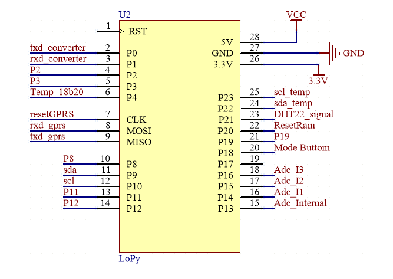
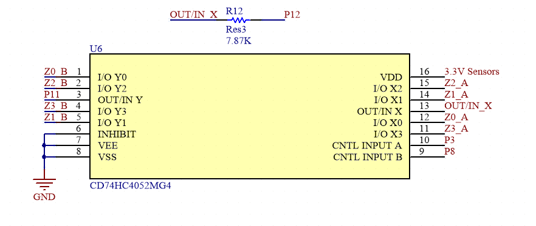
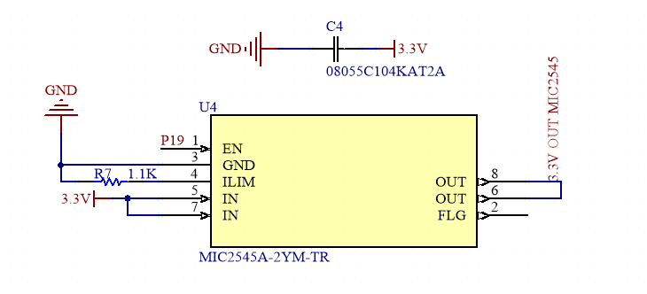
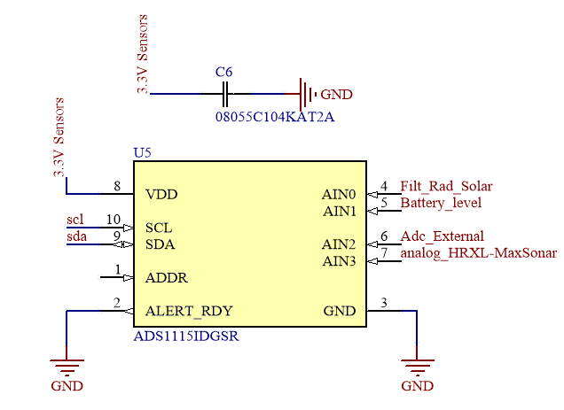

# Sensors and communication protocols

## Technical Characteristics

The central processing unit of the equipment is the Lopy4 development board. The most relevant features were taken from [Lopy 4 datasheet](https://docs.pycom.io/datasheets/development/lopy4/#datasheet).

### Electrical

- Input voltage: 3.5 - 4.2V
- Output voltage: 3.3V, 1.2 A.
- Max Input sink current - GPIO: 12mA
- Input leakage current: 50nA
- Max Output source current: 12mA

### CPU
- Xtensa® dual–core 32–bit LX6 microprocessor(s), up to 600 DMIPS
- Hardware floating point acceleration
- Python multi–threading
- An extra ULP–coprocessor that can monitor GPIOs and the ADC channels and it can control most of the internal peripherals during deep–sleep mode while only consuming ~25uA

### Memory
- RAM: 520KB + 4MB
- External flash: 8MB

### LoRa

- Frequency Range: 137–1020MHz
- Spreading factor: 6 – 12
- Effective Bitrate: 0.018 – 37.5 kpbs
- Sensitivity: –111 to –148 dBm

### WiFi
- 802.11b/g/n 16mbps.

### Bluetooth
- Low energy and classic
- Compliant with Bluetooth v4.2 BR/EDR and BLE
- +12 dBm transmitting power
- Standard HCI based on SDIO/SPI/UART specification

### GPRS
- Supports command including 3GPP TS 27.007, 27.005 and SIMCOM enhanced AT Commands.
- Working Voltage: 3.5~4.2V
- Quad-band 850/900/1800/1900MHz
- Send and receive GPRS data (TCP/IP, HTTP, etc.)
- Low current consumption - 1mA in sleep mode.

### Power Supply
- Lithium battery 
    - 3.7V 5000mAh. 

### Temperature / Humidity Sensor (DHT22)

Es un sensor digital que puede ser integrado a la placa de circuito impreso (PCB). Tiene una salida digital con la señal de temperatura y humedad. A continuación se indican sus características principales (ver [DHT22](https://www.sparkfun.com/datasheets/Sensors/Temperature/DHT22.pdf)):

- Operating Voltage: 3.5V to 5.5V.
- Operating current: 0.3mA (measuring) 60uA (standby)
- Output: Serial data.
- Temperature Range: -40°C to 80°C.
- Humidity Range: 0% to 100%
- Accuracy: ±0.5°C and ±1%
 
### MB7388 HRXL-MaxSonar-WRMLT Sensor

The MB7388 HRXL-MaxSonar-WRMLT sensor is a cost-effective solution for applications that requiere accurate distance detection. The main technical features are taken from [HRXL-MaxSonar- WR Series](https://www.maxbotix.com/documents/HRXL-MaxSonar-WR_Datasheet.pdf).

- Low cost ultrasonic rangefinder.
- Detection out to 10-meters
- Resolution of 1-mm
- Distance sensor 50-cm to 10-meters
- Operating voltage of 2.7V to 5.5V
- Nominal current draw of 2.3mA (peak ~49mA) at 3.3V.

###  Rain collector with AeroCone 

El sensor de precipitación es de tipo balancín, el cual concentra la lluvia en un cono que al llenarse provoca un cambio de estado de 0 a 3.3V. Las principales características son tomadas de [Rain collector with AeroCone.](https://manuals.plus/davis/rain-collector-manual.pdf)

- Collecting area : 214 cm²
- Resolution : 0,2 mm
- Accuracy : ± 5% up to intensity of max. 2 mm/min.
- Output : contact closure
- Material : UV-stabilized ABS plastic
- Mounting : on a flat surface
- Delivered with bird spikes, new filter and 12 m cable

### Soil temperature sensor (DS18B20)

El sensor de temperatura DS18B20 es una sonda que mide la temperatura de forma precisa en ambientes húmedos, tiene 3 cables; 2 son utilizados para alimentación y el restante es el de la señal digital. Las principales características (ver [DS18b20](https://www.gaimc.com/Uploads/Download/Temperature/GTS200.pdf))se indican a continuación:

- 3.0-5.5V input voltage 
- Waterproof
- -55°C to +125°C Temperature range 
- ±0.5°C accuracy from -10°C to +85°C
- 1 Wire interface 
- Probe is 7mm in diameter and roughly 26mm long, overall length (including wire) is 6 feet.

### Soil Moisture Sensor 

El sensor de humedad de suelo es una sonda que permite medir la resistencia eléctrica de un sólido y por intermedio de la misma se mide la tensión del suelo. Para lo cual se utiliza un circuito de excitación que se puede encontrar en [IRROMETER](https://www.irrometer.com/pdf/sensors/403%20WATERMARK%20Sensor-WEB.pdf). Las caracteristicas principales se detallan a continuación:

- 0-200 Centibar range
- Stainless steel enclosure
- Fully solid state
- Will not dissolve in soil
- Not affected by freezing temperatures
- Internal compensation for commonly found salinity levels
- Inexpensive
- Easy to use
- No maintenance

### Sensor de Radiación Solar

Es un sensor analógico que mide la radiación global por intermedio de un fotodiodo, el sensor entrega un valor de voltaje que corresponde a la radiación. Se puede encontrar un manual de instalación en [Sensor de Radiación Solar](https://www.davis-tr.com/Downloads/6450_6490_Instruction_Manual.pdf). Algunas de sus características se presentan a continuación (ver [Caracteristicas del Sensor de Radiación](https://www.arcus-eds.de/fileadmin/arcus/Doku/30_Doku_S8/6450_SS.pdf)):

- Respuesta espectral: 400 a 1.100 nm
- Rango: 0 a 1.800 W/m2
- Precisión: ±5%
- Deriva: 2% por año (máx.)
- Voltaje de alimentación: 3 VDC
- Consumo: 1 mA
- Señal de salida: 0 a 3 VDC
- Temperatura de funcionamiento: -40ºC a 65ºC
- Material: plástico ABS resistente a los rayos UV
- Dimensiones: 51 x 70 x 57 mm
- Peso: 75 g

### Temperature / Humidity Sensor

Es un sensor digital, el sensor mide las dos variable y puede ser integrado a un microcontrolador por la interfaz I2C. A continuación se presentan sus características principales (ver [Sensor de temperatura y humedad](https://weerhuisje.nl/Weerhuisje-docs/davis/IM_6830.pdf)):

- Resolution and Units 0.1°F or 0.1°C (user-selectable).
- Range -40° to +150° F (-40° to +65° C).
- Sensor Accuracy ±0.5°F (±0.3°C).
- Update Interval 10 to 12 seconds.

## Hardware component description.

### River Level Sensor

El hardware está integrado en un Placa de Circuito Impreso (PCB), el mismo tiene como componente principal el módulo de desarrollo Lopy4, encargado de realizar las tareas de control, almacenamiento y transmisión. 

Los demás perifericos con los que cuenta el dispositivo (RTC ds3231, FTDI Basic, DHT22 y MB7388 HRXL-MaxSonar-WRMLT sensor) están conectados a la mencionada Unidad Central de Procesamiento (Lopy4). 

Además del PCB mencionado anteriormente, el dispositivo cuenta con una bateria de Litio de 3.7V, para alimentar la placa. En la siguiente figura se observa una vista 3D del dispositivo IoT LoRa River Level con cada uno de sus componentes, que se detallan a continuación:

||
|-----------|
|IoT LoRa River Level Sensor Datalogger|

- U1: GPRS module SIM800L.
- U2: Lopy 4.
- U3: RTC DS3231.
- J1: Temperature and humidity sensor DHT22.
- P1: Power In connector.
- H1: Jumper conector - boot mode selector.
- H4: usb to serial converter.
- S1: Operating mode selector button
- B2: Header - Power sensor.
- B1: Header - Signals sensor.

#### Lopy4 connections.

La tarjeta Lopy4 cuenta con 28 pines, entre los cuales están los pines de alimentación y una salida de 3.3V, la disposición de los mismos podemos observar en la figura a continuación. También se detalla la conexión de pines con los perifericos.

||
|-----------|
|Lopy4 pin connections.|

- P0: Rx P1: Tx. Comunicación UART con el FTDI Basic.
- P2: Pin de Arranque, para actualizar el firmware.
- P3: Tx P4: Rx. Comunicación UART con el SIM 800L.
- P8: Pin de Arranque para el SIM 800L.
- P9: SDA P10: SDL. Comunicación I2C con el RTC ds3231.
- P11: Pulse Width Output Sensor.
- P12: Pin 4- Ranging Start/Stop Sensor.
- P20: Pin de control de modo de funcionamieto.
- P21: Pin de control de fuente de los sensores.
- P22: Pin de lectura del nivel de tensión de Batería.
- P23: Pin de lectura de señal del sensor DHT22. 

#### DHT22
El sensor de temperatura y humedad interno, está conectado a un pin digital del MCU, configurado como entrada, también se conecta una resistencia de pull up a la salida de la señal, ver la siguiente figura.

||
|-----------|
|DHT22 pin connections.|

#### FTDI BAsic

El módulo se conecta al MCU a través del protocolo UART y comparte la misma referencia de GND.

#### RTC Ds3231

Esté periferico se conecta al MCU a través del protocolo I2C, se utilizan dos resistencia de pull up en los pines de comunicación (ver la figura a continuación), además cuenta con una pila pequeña que lo alimenta en caso de corte de energía.

||
|-----------|
|RTC DS3231 pin connections|

#### MB7388 HRXL-MaxSonar-WRMLT

El sensor está conectado al MCU por intermedio de los puertos GPIO digitales, para realizar la lectura y el control del mismo; utiliza dos conectores de tipo bornera para facilitar su integración en la placa electrónica.

||
|-----------|
|Header for MB7388 sensor pin connections.|

### Multi Sensor 

El hardware está integrado en un Placa de Circuito Impreso (PCB), el mismo tiene como componente principal el módulo de desarrollo Lopy4, encargado de realizar las tareas de control, almacenamiento y transmisión. 

Los demás perifericos con los que cuenta el dispositivo (RTC ds3231, FTDI Basic, DHT22, adc-ads1115, MIC2545A-2YM-TR, CD74HC4052 y los conectores para los sensores) están integrados a la mencionada Unidad Central de Procesamiento (Lopy4). 

Además del PCB mencionado anteriormente, el dispositivo cuenta con una bateria de Litio de 3.7V, para alimentar la placa. En la siguiente figura se observa una vista 3D del dispositivo IoT LoRa Multi Parameter Sensor con cada uno de sus componentes, que se detallan a continuación:

||
|-----------|
|IoT LoRa Multi Parameter Sensor Datalogger|

- U2: Lopy 4.
- U3: RTC DS3231.
- J1: Temperature and humidity sensor DHT22.
- J3: RJ11 for solar Radiation sensor.
- J4: RJ11 for external Temperature and humidity sensor.
- J5: RJ11 for rain sensor.
- P1: Power In connector.
- P2: usb to serial converter.
- H1 H2: Jumper conector - boot mode selector.
- S1: Operating mode selector button
- B1 B2 B3 B4: Header - Soil humidity sensor.
- B5: Header - Soil temperature sensor.
- B6: Header - River Level sesnor.
- B7 B8: Header - Analog inputs. 

#### Lopy4 connections.

La tarjeta Lopy4 cuenta con 28 pines, entre los cuales están los pines de alimentación y una salida de 3.3V, la disposición de los mismos podemos observar en la figura a continuación. También se detalla la conexión de pines con los perifericos.

||
|-----------|
|Lopy4 pin connections Multi-Sensor PCB.|

- P0: Rx P1: Tx. Comunicación UART con el FTDI Basic.
- P2: Pin de Arranque, para actualizar el firmware.
- P3: Pin A de Control del multiplexador CD74HC4052.
- P4: Pin de lectura del sensor de temperatura 18b20.
- CLK: Pin de control de GPRS SIM800L (si se utilza).
- MOSI: Tx MISO: Rx. Comunicación UART con GPRS SIM800L.
- P8: Pin B de Control del multiplexador CD74HC4052.
- P9: SDA P10: SDL. Comunicación I2C con el RTC ds3231, el adc-ads1115 y el contador de pulsos S-35770E01I-K8T2U.
- P11: Polo 1 de alimentación del sensor de humedad del suelo.
- P12: Polo2 de alimentación del sensor de humedad del suelo.
- P13: Adc interno para lectura del sensor de humedad de suelo.
- P14, P15, P16: Pines para lectura de sensores analógicos de 0-3.3V.
- P18: Lectura de pulsante para cambio de modos de funcionamiento.
- P19: Pin de activación de alimentación para los sensores.
- P20: Pin de reset de los pulsos contados desde el sensor de lluvia.
- P21: Pin de lectura de señal del sensor DHT22. 
- P22: Pin SDA para lectura de sensor de temperatura y humedad externa.
- P23: Pin SCL para lectura de sensor de temperatura y humedad externa.

#### Multiplexor CD74HC4051.

El multiplexor es utilizado para medir hasta 4 sensores de humedad de suelo con un único dispositivo lopy4. Se puede cambiar desde el software los canales para la lectura de los diferentes sensores. A continuación se presenta un diagrama de las conexiones.

||
|-----------|
|Multiplexor CD74HC4051 connections.|

#### High-side switch MIC2545A.

Es un interruptor que se encarga de desconectar la alimentación de los sensores, cuando entra en modo de sueño profundo; con la finalidad de reducir el consumo energético. El diagrama de conexión se muestra en la siguiente figura:

||
|-----------|
|High-side switch MIC2545A connections.|

#### ADC ads1115.

Es el encargado de adquirir los datos analógicos de la tensión de la batería y los sensores de radiación solar y humedad del suelo. Los datos son convertidos a un valor entero y los pasa al MCU por la interfaz I2C. El diagrama de conexión se muestra a continuación

||
|-----------|
|ADC ads1115 connections.|

#### Conectores para los sensores.

Se utilizan los siguientes conectores:

- 3 RJ11 para los sensores de radiación solar, lluvia, temperatura y humedad ambiental.
- 4 borneras de 2 posiciones para sensores de humedad de suelo.
- 3 borneras de 3 posiciones para los sensores de temperatura de suelo, nivel de agua y otros sensores analógicos.

||
|-----------|
|Pluviometric sensor connections.|

||
|-----------|
|Solar Radiation sensor connections.|

||
|-----------|
|Temperature and humidity sensor connections.|

||
|-----------|
|Soil Temperature sensor connections.|

## Start-up

En esta sección se presenta la puesta en marcha del dispositivo, se describe los comandos necesarios para la configuración. 

Para comenzar la configuración del Gateway, es necesario descargar el software para gestión y programación según lo indicado en la pagina de [Documentos de Pycom Lopy 4](https://docs.pycom.io/gettingstarted/software/). Se puede trabajar con las 2 opciones tanto el software "ATOM" como también "Visual Studio Code".

En caso de usar Windows es necesario descargar los drivers del conversor Usb-serial desde la página de [FTDI Chip - VCP](https://ftdichip.com/drivers/vcp-drivers/), de esta manera se tiene el puerto COM correspondiente.

Una vez se han instalado los componentes de software, conecte la placa a la alimentación a travéz de P1 y a una PC con un cable micro USB para uso de datos, a travéz de P2 y H4 en las PCB Multi-Sensor y de Nivel de Rio respectivamente.

La placa tiene un led que indica el arranque normal del sistema y el modo en que se encuentra funcionando. La secuencia inicia con el led de color rojo encendido por 1 segundo, lo que quiere decir que la placa entra en modo de espera (Modo de configuración).

||
|-----------|
|USB connection.|

### Mododos de funcionamiento.

En el modo de configuración el sistema está a la espera de ejecutar algún comando. Al cargar el software por primera vez, el sistema entrará en este modo y se encenderá un LED ROJO como indicador.

El sistema realiza automáticamente el siguiente proceso:

- Envía el paquete de sincronización por LoRa y espera por a respuesta del Gateway.
- Si obtiene la respuesta del gateway, sincroniza el tiempo del RTC DS3231.
- Si no obtiene respuesta del gateway, obtiene el tiempo del RTC DS3231.
- Espera la ejecución del comando.

Para configurar primero debemos ejecutar el siguiente comando, este se encarga de sincronizar la hora del dispositivo (NODO) con la del GAteway y actualizarla en el RTC DS3231.

```python:
SincNodefromGateway()
```   
El dispositivo debe permanecer en este modo de funcionamiento para sincronizar la hora y la fecha del nodo. Una vez sincronizado, se puede enviar los paquetes por lorawan, ejecutando los siguientes comandos:

```python:
joinLoraWan()
dataSendLoraWan()
```   
Para entrar en el modo de ejecución, se ejecuta el siguiente comando. 

```python:
runModeOutConsole()
```

### Run mode - Active console.

Este es el modo en el que el dispositivo permanecerá constantemente en funcionamiento. El dispositivo realizará los siguientes pasos:
    
- Sincronización de fecha y hora, a través del RTC DS3231.
- Iniciación de la alarma para la transmisión de paquetes.
- Se activa alarma.
- Se adquiere datos de los sensores y se almacena.
- Se une a la red lorawan y transmite los paquetes.
- Entra en modo de reposo profundo.
    
### Run mode - Inactive console,

Este es el modo en el que el dispositivo permanecerá constantemente en funcionamiento. El dispositivo realizará los siguientes pasos:
    
- Sincronización de fecha y hora, a través del RTC DS3231.
- Desabilita la consola.
- Iniciación de la alarma para la transmisión de paquetes.
- Se activa alarma.
- Se adquiere datos de los sensores y se almacena.
- Se une a la red lorawan y transmite los paquetes.
- Entra en modo de reposo profundo.

## Métodos de configuración.

### Real time clock (RTC) ds3231

The external real time clock (RTC) ds3231 is the one that will keep the system synchronized in time and date, due to an independent battery. The methods for synchronization are presented below.

```python:
ds3231.ds1307init_sinc(None)
```

-   Synchronizes the external real-time clock (ds3231) with the internal
    time (lopy 4).
-   Response: (year, day, month, hour, minute, second, millisecond,
    None)

```python:
get_time_ds3231(None)
```

-   Obtains the date and time from the external real-time clock
    (ds3231).
-   Response: (year, day, month, hour, minute, second, millisecond,
    None)

```python:
ds3231.sinc_RTC_from_ds3231(None)
```

-   Synchronizes the internal clock (lopy 4) with the time of the
    external real-time clock (ds3231).
-   Response: (year, day, month, hour, minute, second, millisecond,
    None)

### Temperature and humidity sensor DHT11

The sensor reading is carried out by the following method:

```python:
result = th.read(None)
```
-   Response: result.temperature
-   Response: result.humidity

### MB7388 HRXL sensor DHT11

The sensor reading is carried out by the following method:

```python:
    level = level_data(None)
```
-   Response: level

### LoRaWan

```python:
    joinLoraWan() 
```
- Configura los parámetros necesarios de la red LoraWan y se une al servidor.
- Respuesta: joined 

```python:
    dataSendLoraWan() 
```
- Adquiere los datos de los sensores, los almacena y los transmite por LoRaWan
- Response: (dataTempInt, dataHumInt, dataLevel)

## Create a docs version

Release a version 1.0 of your project:

```bash
npm run docusaurus docs:version 1.0
```

The `docs` folder is copied into `versioned_docs/version-1.0` and `versions.json` is created.

Your docs now has 2 versions:

- `1.0` at `http://localhost:3000/docs/` for the version 1.0 docs
- `current` at `http://localhost:3000/docs/next/` for the **upcoming, unreleased docs**

## Add a Version Dropdown

To navigate smoothly across versions, add a version dropdown.

Modify the `docusaurus.config.js` file:

```js title="docusaurus.config.js"
module.exports = {
  themeConfig: {
    navbar: {
      items: [
        // highlight-start
        {
          type: 'docsVersionDropdown',
        },
        // highlight-end
      ],
    },
  },
};
```

The docs version dropdown appears in your navbar:


## Update an existing version

It is possible to edit versioned docs in their own folder:

- `versioned_docs/version-1.0/hello.md` updates `http://localhost:3000/docs/hello`
- `docs/hello.md` updates `http://localhost:3000/docs/next/hello`
