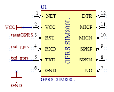
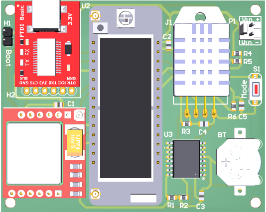

# Gateway

En este documento por una parte, se describe las características técnicas de hardware, así como también se detalla los componentes del dispositivo. Por otra parte, se indican los métodos de programación y los comandos de configuración del dispositivo concentrador de datos meteorológicos (Iot-LoRa-Gateway). El producto es compatible con dispositivos que cuenten con comunicación LoRa.

## Technical Characteristics

La unidad central de procesamiento del equipo es la tarjeta de desarrollo LoPy4, las características de mayor relevancia fueron tomadas
de [Lopy 4 datasheet!](https://docs.pycom.io/datasheets/development/lopy4/#datasheet).

### Electrical

-   Voltaje de entrada: 3.5 - 4.2V
-   Voltaje de salida: 3,3V, 1.2 A.
-   Corriente sink máxima de entrada - GPIO: 12mA
-   Corriente de fuga de entrada: 50nA
-   Corriente máxima de fuente de salida: 12mA

### CPU

-   Microprocesador Xtensa® dual–core 32–bit LX6, hasta 600 DMIPS
-   Aceleración de punto flotante de hardware
-   Python multi–hilo
-   Un coprocesador ULP extra que monitorea los GPIOs, los canales ADC y controla la mayoría de periféricos durante el modo deep-sleep mientras consume solo 25uA

### Memory

-   RAM: 520KB + 4MB
-   Flash Externa: 8MB

### LoRa

-   Rango de Frequencia: 137–1020MHz
-   Factor de Ensanchamiento: 6 – 12
-   Bitrate Efectivo: 0.018 – 37.5 kpbs
-   Sensibilidad: –111 to –148 dBm

### WiFi

-   802.11b/g/n 16mbps.

### Bluetooth

-   Bajo consumo de energía y clásico.
-   Compatible con Bluetooth v4.2 BR/EDR y BLE
-   +12 dBm de potencia de transmisión
-   HCI estándar basado en las especificaciones SDIO/SPI/UART

### GPRS

-   Soporta comandos incluyendo 3GPP TS 27.007, 27.005 y los comandos AT mejorados SIMCOM
-   Voltaje de trabajo: 3.5 4.2V
-   Cuatribanda 850/900/1800/1900MHz
-   Envía y recibe datos GPRS (TCP/IP, HTTP, etc.)
-   Bajo consumo de corriente - 1mA en modo sleep.

### Fuente de alimentación

-   Batería de Litio de 3.7V 6000mAh.
-   Controlador de carga MPPT para baterías de Litio de 3.7V .
-   Panel solar de 6V.

## Descripción del componente de hardware

El hardware está integrado en un Placa de Circuito Impreso (PCB por sus siglas en inglés), el componente principal del PCB es el módulo de desarrollo LoPy4. Este módulo es el encargado de realizar las tareas de control, almacenamiento y transmisión. Los demás periféricos con los que cuenta el dispositivo (RTC ds3231, FTDI Basic, DHT22 y GPRS SIM800L) están conectados al Lopy4.

Además del PCB, el dispositivo cuenta con una batería de Litio, un controlador de carga MPPT y un panel solar de 6V.

|  |
|:--:| 
| *IoT LoRa Gateway Architecture* |

### Lopy4 connections

La tarjeta Lopy4 cuenta con 28 pines, entre los cuales están los pines de alimentación y una salida de 3.3V. La disposición de los pines se muestra en la figura [fig:Lopy4PinCon]. A continuación se detalla los pines que se conectaron a los periféricos.

-   P0: Rx P1: Tx. Comunicación UART con el FTDI Basic.
-   P2: Pin de Arranque, para actualizar el firmware.
-   P3: Tx P4: Rx. Comunicación UART con el SIM 800L.
-   P8: Pin de Arranque para el SIM 800L.
-   P9: SDA P10: SDL. Comunicación I2C con el RTC DS3231.
-   P21: Pin de control de modo de funcionamieto.
-   P22: Pin de lectura del nivel de tensión de batería.
-   P23: Pin de lectura de señal del sensor DHT22.


### Conexiones Periféricas

### DHT22

El sensor de temperatura y humedad interno está conectado a un pin digital del MCU configurado como entrada; también se conecta una resistencia de pull up a la salida de la señal, ver figura [fig:DHT22PinCon].

 [fig:DHT22PinCon]

### GPRS SIM800L

Este periférico utiliza el protocolo UART para conectarse al MCU y un pin digital para el control de arranque del mismo, como se observa en la figura [fig:Sim800LPinCon]. Está alimentado desde la batería de litio (3.7V - 4.2V).


[fig:Sim800LPinCon]

### FTDI Basic

El módulo se conecta al MCU a través del protocolo UART y comparte la misma referencia de GND.

### RTC DS3231

Este periférico se conecta al MCU a través del protocolo I2C, se utilizan dos resistencia de pull up en los pines de comunicación (ver figura [fig:DS3231PinCon] ), además cuenta con una pila pequeña que lo alimenta en caso de corte de energía.

[fig:DS3231PinCon]

# Instalación y Start-up

Esta sección presenta la puesta en marcha del dispositivo, brinda una breve descripción del software que se utilizará y describe los comandos necesarios para la configuración. La figure [fig:gateway~3~d] muestra una vista en 3D del dispositivo IoT LoRa Gateway con cada uno de sus componentes, los cuales son detallados a continuación:

-   U1: Módulo GPRS SIM 800L
-   U2: LoPy4
-   U3: RTC DS3231
-   J1: Sensor de temperatura y humedad DHT22
-   P1: Conector de entrada de alimentación
-   H1: Conector Jumper - selector del modo boot.
-   H2: Convertidor de usb a serial.
-   S1: Botón selector de modo de funcionamiento

 [fig:gateway~3~d]

#Start-up

Para comenzar la configuración del Gateway, es necesario descargar el software para gestión y programación según lo indicado en la página de [Documentos de Pycom Lopy4](https://docs.pycom.io/gettingstarted/software/). Se puede trabajar con las 2 opciones tanto el software "ATOM" como también "Visual Studio Code".

En caso de usar Windows es necesario descargar los drivers del conversor Usb-serial desde la página de [FTDI Chip -VCP](https://ftdichip.com/drivers/vcp-drivers/), de esta manera se tiene el puerto COM correspondiente.

Una vez que se han instalado los componentes de software, se conecta la placa a la alimentación a travéz de P1 y a una PC con un cable micro USB para uso de datos, a travéz de P2.

La placa tiene un led que indica el arranque normal de la placa y el modo en que se encuentra funcionando. La secuencia inicia con el led de color verde encendido por 3 segundos, lo que quiere decir que la placa entra en modo de espera (Modo de configuración).

 [fig:usbConnect]

Ahora es necesario abrir el entorno de programación, para agregar el dispositivo COM y configuar el dispositivo gateway. A continuación se detallan los pasos a seguir:

-   Abrir Pymakr.
     [fig:pymakrOPEN]

-   Abrir las configuraciones Globales.
    
    [fig:globalSettings]
    
-   Configurar el puerto correspondiente, y verificar desde el device manager.
     [fig:globalSettings]
    
-   Abrir el puerto COM desde los dispositivos conectados.
     [fig:OpenCom]
    
    [fig:OpenCom]

Métodos de configuración
---------------------

### Operación del sistema

Como se mencionó en el apartado anterior, el led verde encendido por 3 segundos luego de conectar la placa, indica que la configuración está lista. Para empezar el funcionamiento automático del sistema se debe crear un archivo de configuración con el método detallado a continuación.

**configFile(stationNum, idStation, Url, NTPServer, frequencyTx)**

-   stationNum: Número de nodos a conectar al Gateway.
-   idStation: ID del Gateway (240 - 255).
-   Url: Url para trasmitir los paquetes via http get.
-   NTPServer: IP del servidor NTP.
-   frequencyTx: Frecuencia de trasmisión de paquetes en minutos.
-   Ejemplo: configFile(3, 250,
    “http://api.thingspeak.com/update?api\_key=XXXX&field1=”,“162.159.200.1”,
    5)

El sistema automáticamente se resetea y el siguiente proceso comienza:

-   Sincronización de fecha y hora.
-   Iniciación de alarma para transmisión de paquetes.
-   Enviar paquete de sincronización a los nodos.
-   Entra en modo deep sleep hasta que el paquete de datos se envía de vuelta al servidor; cuando se llega a la hora de envío, el sistema realiza el siguiente proceso repetitivo:
    -   Sincronización de fecha y hora.
    -   Iniciación de alarma para transmisión de paquetes.
    -   Enviar paquete de asignación de canal.
    -   Enviar datos al servidor.
    -   Entra en modo de deep sleep hasta que el paquete de datos se envía de vuelta al servidor

### Conexión móvil GPRS SIM800L

Para configurar el dispositivo, lo primero que hay que tener en cuenta es la sincronización horaria a través de NTP y el GPRS SIM 800L. Los siguientes son los métodos para la sincronización con el módulo GPRS SIM 800L.

**sim800L.signalLevel(None)**

-   Respuesta: +CSQ: rssi, ber
    -   rssi
        -   0: -115 dBm or less
        -   1: -111 dBm
        -   2...30: -110... -54 dBm
        -   31: -52 dBm or greater
        -   99: not known or not detectable
    -   ber (en porcentaje):
        -   0...7 As RXQUAL values in the table in GSM 05.08
        -   99 Not known or not detectable

**sim800L.GPRS\_init(None)**

-   Respuesta: +SAPBR: cid, Status, IP\_Addr
    -   cid : Identificador de perfil de portador
    -   Estado
        -   0 El portador se está conectando
        -   1 El portador está conectado
        -   2 El portador se está cerrando
        -   3 El portador está cerrado
    -   IP\_Addr: dirección IP

**sim800L.GPRS\_NTP(None)**

-   Respuesta: +SAPBR: cid, Status, IP\_Addr
    -   cid : Identificador de perfil de portador
    -   Estado
        -   0 El portador se está conectando
        -   1 El portador está conectado
        -   2 El portador se está cerrando
        -   3 El portador está cerrado
    -   IP\_Addr: dirección IP
-   Respuesta: (año, día, mes, hora, minuto, segundo, milisegundo, Ninguno)

### Reloj en tiempo real (RTC) DS3231

El reloj externo en tiempo real (RTC) DS3231 es el que mantendrá sincronizado el sistema en hora y fecha, ya que cuenta con una batería independiente. Los métodos para la sincronización se presentan a continuación.

**ds3231.ds1307init\_sinc(None)**

-   Sincroniza el reloj externo en tiempo real (ds3231) con el tiempo interno (LoPy 4).
-   Respuesta: (año, día, mes, hora, minuto, segundo, milisegundo, Ninguno)

**get\_time\_ds3231(None)**

-   Obtiene la fecha y la hora del reloj externo en tiempo real (ds3231).
-   Respuesta: (año, día, mes, hora, minuto, segundo, milisegundo, Ninguno)

**ds3231.sinc\_RTC\_from\_ds3231(None)**

-   Sincroniza el reloj interno (LoPy 4) con el tiempo del reloj externo (DS3231).
-   Respuesta: (año, día, mes, hora, minuto, segundo, milisegundo, Ninguno)

### Sensor de temperatura y humedad DHT22

La lectura del sensor se realiza mediante el siguiente método:
```python:
result = th.read(None)
```

-   Respuesta: result.temperature
-   Respuesta: result.humidity

En esta sección por una parte, se describe las características técnicas de hardware, así como también se detalla los componentes del dispositivo. Por otra parte, se indican los métodos de programación y los comandos de configuración del dispositivo concentrador de datos meteorológicos (Iot-LoRa-Gateway). Cabe mencionar que el producto es compatible con dispositivos que cuenten con comunicación LoRa. 

## Características técnicas

La unidad central de procesamiento del equipo es la tarjeta de desarrollo Lopy4, las caracteristicas de mayor relevancia fueron tomadas de https://docs.pycom.io/datasheets/development/lopy4/#datasheet {Lopy 4 datasheet.}.

## Funcionalidad y costo


## Hardware (Todos los detalles necesarios para construirlo)


## Scripts (Todos los scripts con algunas explicaciones)

It is possible to edit versioned docs in their respective folder:

- `versioned_docs/version-1.0/hello.md` updates `http://localhost:3000/docs/hello`
- `docs/hello.md` updates `http://localhost:3000/docs/next/hello`
